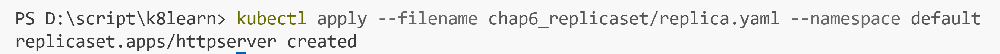
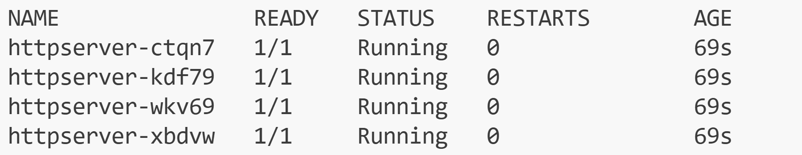

## ReplicaSet
pod単体の利用は本番運用時には向かない
代わりにReplicaSetを使う

```bash
kubectl apply --filename chap6_replicaset/replica.yaml --namespace default
```



複数のpodが立ち上がる。末尾に文字がつく。



ReplicaSetの確認

```bash
kubectl get replicaset --namespace default
```

後始末
```bash
kubectl delete -f .\chap6_replicaset\replica.yaml --namespace default
```
## Deployment
- ReplicaSetはPodと同様に、本番環境では非推奨
- Deploymentを使う
- DeploymentはReplicaSetを管理する
- 古いReplicaSetから新しいReplicaSetへローリングアップデートが可能
- ローリングアップデート: サービスを止めることなくアプリケーションのバージョンアップを行う手法

```bash
kubectl apply --filename chap6_replicaset/deploy.yaml --namespace default    
```
後始末
```bash
kubectl delete -f ./chap6_replicaset/deploy.yaml --namespace default
```

## Rolling Update(Strategy)

Strategy TypeにはRecreateとRollingUpdateの2種類がある

変化を見るために、watchで確認.
```bash
kubectl get pod -w --namespace default
```

### Recreate
```bash
kubectl apply --filename chap6_replicaset/recreate.yaml --namespace default    
```

podが一斉に入れ替わる

後始末
```bash
kubectl delete -f ./chap6_replicaset/recreate.yaml --namespace default
```

### RollingUpdate
```bash
kubectl apply --filename chap6_replicaset/rollingupdate.yaml --namespace default
```